### Hi my name is Leandro!! How are you?👋

- 🔭 Hoje estou apenas estudando ADS (Análise e Desenvolvimento de Sistemas);
- 🌱 Estou estudando mais a linguagem C# (Front-End, Back-End .NET, etc...);
- 🔗 Meu linkedIn: [Leandro Di Nardo Lazarin](https://www.linkedin.com/in/leandro-di-nardo-lazarin-694a59236/)
- 🔗 Meu Facebook: [Leandro Di Nardo Lazarin](https://www.facebook.com/leandro.dinardolazarin/)
- 🔗 Meu Whatsapp: [Leandro Di Nardo Lazarin](https://api.whatsapp.com/send/?phone=5543999529636&text&app_absent=0)
- 😄 Pronouns: Ele/Dele/He/His;
- 💓 I love tecnology;

 

  <a href="https://github.com/Leandrodnl09">
  
  

  

  
  

 
  
  
  
  
  
  
  
  
  
 
 
 

  
   
  

 

  

